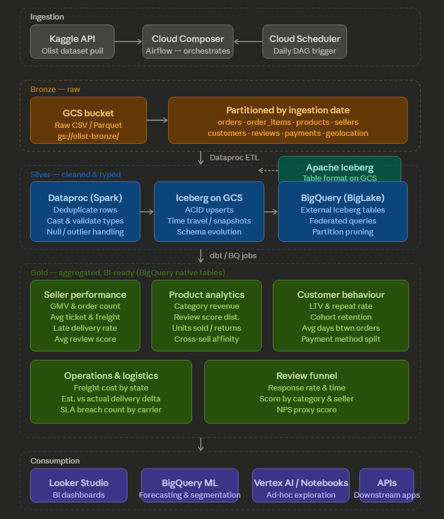

# OLIST LAKEHOUSE
This repo contains end to end data platform for Brazilian E-Commerce (Olist) on Kaggle — Orders, products, sellers, reviews across multiple relational tables. 

## 1. About Dataset - Data Model
This dataset contains 9 tables, categorized in :
1. Dimensions 
    - **Reference Dimensions** (Full Overwrite) : Extract entire source table daily 
        -  olist_geolocation_dataset (Zip codes and coordinates)
        -  product_category_name_translation (English translations)

    - **Type 1 SCD Fact** (Upsert) : Keep only latest records. Not storing history. 
        - olist_customers_dataset (Customer info)
        - olist_products_dataset (Product info)
        - olist_sellers_dataset (Seller info)
    
2. Facts
    - **Accumulating Snapshot Facts** : the order is updated as it moves through various statuses (created, approved, shipped, delivered)
        - olist_orders_dataset (Upsert) 
    - **Transactional Fact** : Append Only Fact - once reviewed, record is saved (immutable). Its a discrete point in time event.
        - olist_order_reviews_dataset 

    - **Line Item Facts** (Child Facts) : Data which also records events but they dont have their own timestamps. They ahve higher granulkarity (more summary)
        - olist_order_payments_dataset
        - olist_order_items_dataset

## 2. Data Ingestion
Done using a python script
- Read data from kaggle API
- Read only some record?
- connect to GCS
- write into a partition folder (based on ingestion date) (how many records can each partition have?)
Run this script daily (automate using airflow)

1. Data Ingestion - through kaggle api
2. Data stored in GCS bucket - bronze layer
3. Airflow etl pipeline - sink to silver layer (runs in Data proc)
4. Silver layer is BQ
5. Gold layer ? What aggregates do I have to create a gold layer ?
6. where does iceberg come in this picture?

According to Claude - 
