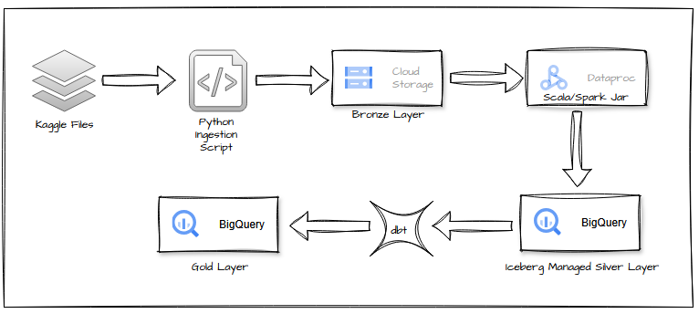

# OLIST LAKEHOUSE

### 📌 Project Overview
The Olist E-Commerce dataset is a rich, real-world dataset capturing over 100,000 orders made across multiple marketplaces in Brazil.
This project builds a production-grade, end-to-end Data Lakehouse on Google Cloud Platform (GCP) to ingest, model, and serve this data for downstream analytics. By implementing a strict Medallion Architecture (Bronze, Silver, Gold) using Apache Spark, Apache Iceberg, and dbt, this platform resolves complex relational dependencies to unlock business insights into delivery performance, customer satisfaction, and seller revenue trends.

### 📊 Data Modelling
This dataset contains 9 tables, categorized in :
1. Dimensions 
    - **Reference Dimensions** (Full Overwrite) : Extract entire source table daily 
        -  olist_geolocation_dataset (Zip codes and coordinates)
        -  product_category_name_translation (English translations)

    - **Type 1 SCD** (Upsert) : Keep only latest records. Not storing history. 
        - olist_customers_dataset (Customer info)
        - olist_products_dataset (Product info)
        - olist_sellers_dataset (Seller info)
    
2. Facts
    - **Accumulating Snapshot Facts** : the order is updated as it moves through various statuses (created, approved, shipped, delivered)
        - olist_orders_dataset (Upsert) 
    - **Transactional Fact** : Append Only Fact - once reviewed, record is saved (immutable). Its a discrete point in time event.
        - olist_order_reviews_dataset 

    - **Line Item Facts** (Child Facts) : Data which also records events but they dont have their own timestamps. They ahve higher granulkarity (more summary) (individual items within an order).
        - olist_order_payments_dataset
        - olist_order_items_dataset

### 🏗️ Architecture & Pipeline 
- Ingestion (to Bronze): A Python ingestion script adds an ingested_timestamp to the downloaded dataset and uploads it to a Google Cloud Storage (GCS) bucket, partitioned and stored in Parquet format.

- Processing (to Silver): Multiple Spark/Scala pipelines transform the raw Bronze data into cleaned, modeled Silver datasets. These are stored as Apache Iceberg managed tables within Google BigQuery.

- Analytics (to Gold): The final presentation layer (Gold) is built and materialized using dbt directly inside BigQuery for downstream reporting.

