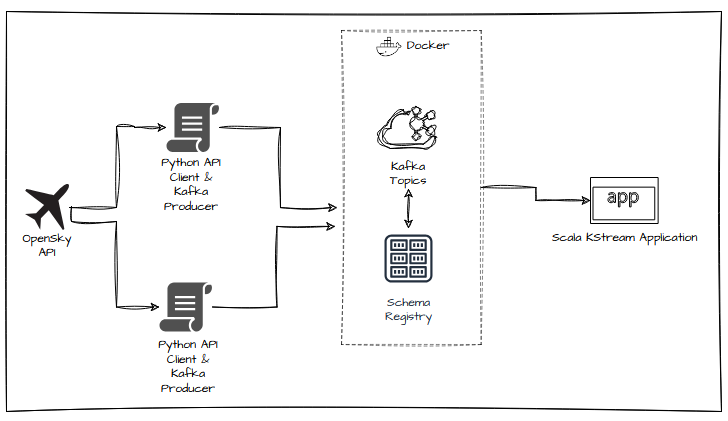

# OpenSky State Stream Engine

### 📌 Project Overview
The OpenSky Network provides multiple ways to access its rich air traffic datasets, ranging from real-time APIs to historical archives and curated scientific datasets. This project utilizes the [OpenSky REST API](https://opensky-network.org/api) to retrieve live airspace information in the form of State Vectors.

The state of an aircraft is a summary of all tracking information (position, velocity, and identity) at a discrete point in time. This pipeline captures these states as JSON objects and processes them in real-time to unlock downstream analytics and predictive modeling capabilities.

### 🎯 Analytical Objectives
This streaming pipeline is designed to answer the following questions and serve the following use cases in real-time:
- **Real-time Kinematic Aggregation**: Calculating the average velocity of aircraft across continuous 5-minute windows.
- **Geospatial Tracking**: Monitoring and maintaining the absolute latest position of active flights.
- **Feature Engineering**: Extracting and engineering kinematic, temporal, and spatial features to feed downstream Machine Learning models (in progress).

### 🏗️ Architecture
- **Ingestion (Python API Client & Redpanda/Kafka)**:Python API clients fetch data from the /states/all and /flights/aircraft endpoints and produce the raw data into their respective Kafka (Redpanda) topics. To respect the free-tier API limit of 4,000 requests per day, the ingestion script is precisely throttled to fetch and produce data every ~20 seconds.

- **Stream Processing (Scala & Kafka Streams)**:A stateful Scala Kafka Streams application consumes from the ingestion topics and executes the following topology:

    - Stateless Cleansing (KStream): Reads the raw topic, filters out aircraft missing coordinate data (null lat/long), maps the payload into a standardized JSON structure, and writes to a clean_vectors topic.

    - Live Tracking (KTable): Aggregates the stream into a KTable to maintain the absolute latest state vector for every aircraft currently in the sky, utilizing state store retention policies to safely evict stale or landed flights.

    - Windowed Aggregation: Executes a 5-minute Tumbling Window to calculate average velocities.

    - Dimensional Enrichment (KStream-GlobalKTable Join): Joins the live, moving flight vector stream with a broadcasted GlobalKTable to append the full Airline Name before pushing to the final output topic.

    - Feature Extraction (Stream-Stream Join): Performs a temporal Stream-Stream join between raw_flights (intent) and clean_vectors (physics) to engineer comprehensive ML features.

    - Schema Evolution: Integrates a Schema Registry to enforce forward compatibility and maintain data contracts across the pipeline.
    

        