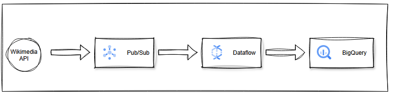

# Wikimedia Stream Analytics using  Google Pub/Sub , Dataflow & BigQuery

### 📌 Project Overview - 
Wikimedia continuously broadcasts real-time events for every change made across any Wikipedia page. This project ingests that live Server-Sent Events (SSE) stream to analyze global editing behaviors in real-time. By classifying bot versus human interactions and analyzing edit types (text vs. media), this pipeline surfaces trending subjects and viral articles as they happen.

### 🎯 Analytical Objectives - 
The streaming pipeline is designed to answer the following questions in real-time:
- Trending Domains (Fixed Window): What are the most heavily edited Wikipedia domains (servers) by human users within a strict 1-minute fixed window?
- Viral Articles (Sliding Window): What specific articles are going viral right now? Calculated over a 5-minute sliding window, updating every 1 minute.
- User Classification: What is the ratio of human-driven edits versus automated bot edits?

### 🏗️ Architecture
This project implements a decoupled, serverless streaming architecture natively on Google Cloud Platform:

**Ingestion (Google Cloud Pub/Sub)**: A Python publisher connects to the stream.wikimedia.org/v2/stream/recentchange endpoint, capturing the live JSON payload and publishing it as a continuous event stream into a Pub/Sub topic.

**Stream Processing (Apache Beam / Cloud Dataflow)**: A serverless Dataflow pipeline consumes the Pub/Sub subscription. It cleans the raw JSON, enriches the payload, and applies temporal windowing (Fixed and Sliding) to aggregate the metrics based on event time.

**Data Warehousing (BigQuery)** : The aggregated metrics and transformed raw records are streamed directly into BigQuery tables, acting as the analytical serving layer for downstream visualization and reporting.

